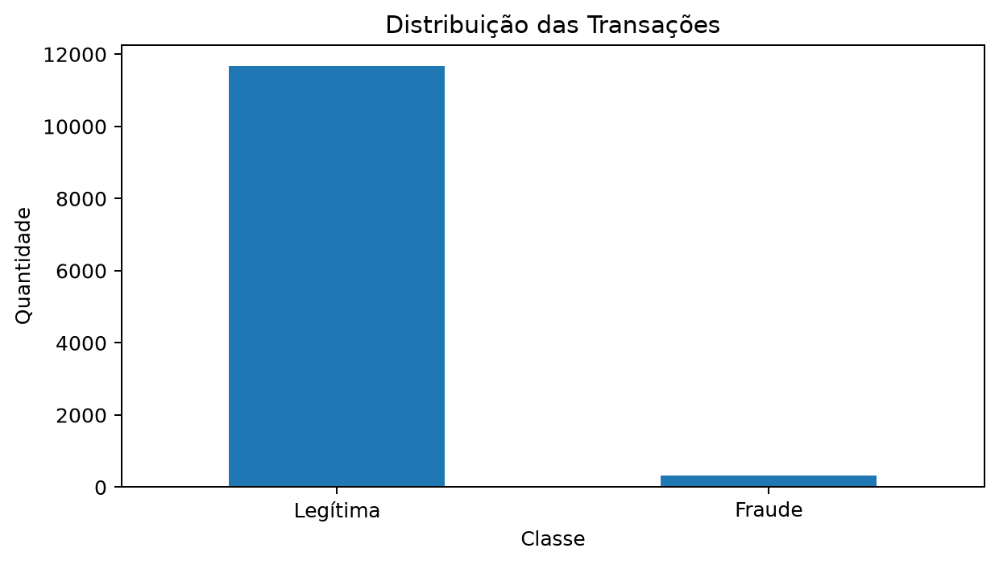
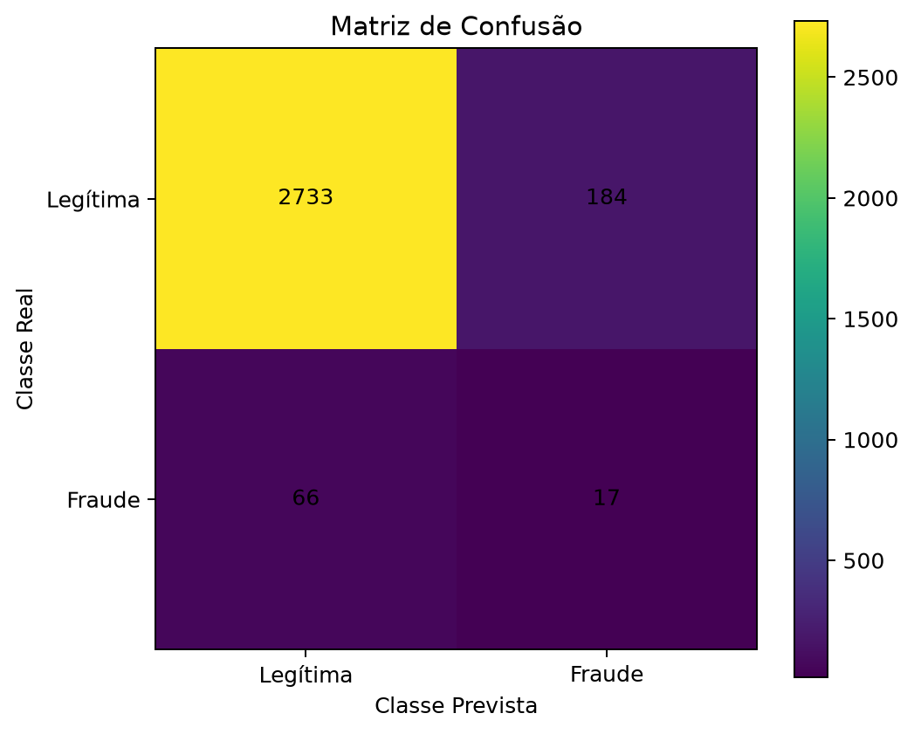
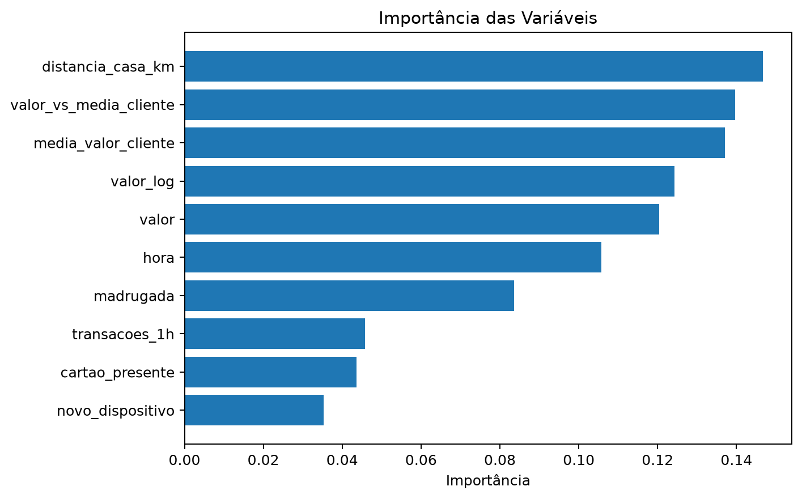
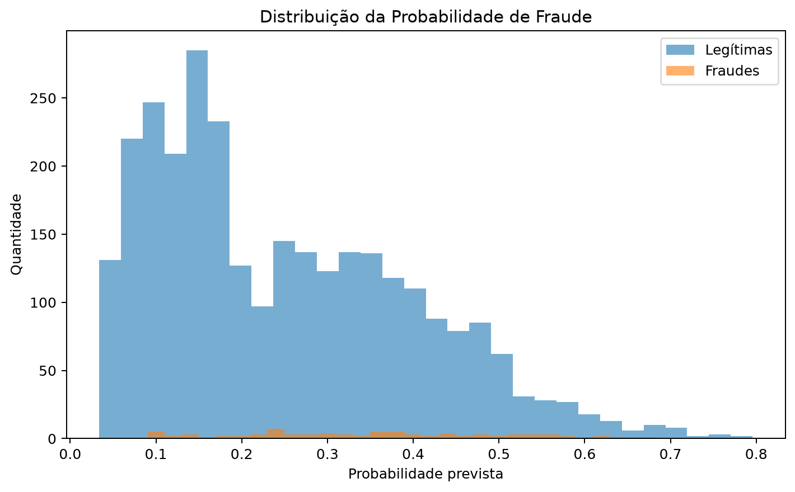

# Detecção de Fraude Bancária com Python e Pandas

[](https://www.python.org/)
[](https://pandas.pydata.org/)
[](https://scikit-learn.org/)
[](https://github.com/michelledelara/deteccao-fraude-bancaria-python/actions/workflows/python-ci.yml)
[](LICENSE)

Projeto de análise de dados e Machine Learning para identificação de **transações bancárias potencialmente fraudulentas**, utilizando Python, Pandas e Scikit-learn.

O projeto foi estruturado como um case de portfólio envolvendo:

- análise exploratória de dados;
- tratamento de classes desbalanceadas;
- feature engineering;
- classificação supervisionada;
- avaliação de risco por métricas apropriadas;
- geração de transações suspeitas;
- análise de importância das variáveis;
- testes automatizados;
- integração contínua com GitHub Actions.

---

## Problema de negócio

Fraudes financeiras representam um desafio relevante porque normalmente correspondem a uma parcela muito pequena do total de transações.

Isso cria um problema clássico de **classificação desbalanceada**.

Um modelo poderia, por exemplo, classificar praticamente todas as operações como legítimas e ainda apresentar uma alta acurácia, sem necessariamente detectar as fraudes de maneira eficiente.

Por esse motivo, este projeto não trata a **accuracy** como única métrica de desempenho.

O foco da avaliação está principalmente em:

| Métrica | Interpretação |
|---|---|
| **Precision** | Entre as transações classificadas como fraude, quantas realmente eram fraudulentas |
| **Recall** | Entre todas as fraudes existentes, quantas o modelo conseguiu identificar |
| **F1-score** | Equilíbrio entre Precision e Recall |
| **ROC-AUC** | Capacidade do modelo de distinguir operações legítimas de fraudulentas |
| **Matriz de Confusão** | Visualização de verdadeiros positivos, falsos positivos, verdadeiros negativos e falsos negativos |

Em um cenário de fraude, **falsos negativos são particularmente relevantes**, pois representam operações fraudulentas que não foram detectadas pelo modelo.

---

## Objetivo

Construir um pipeline capaz de:

1. gerar um conjunto de transações sintéticas;
2. explorar e preparar os dados com Pandas;
3. criar variáveis associadas a comportamentos potencialmente suspeitos;
4. treinar um modelo de classificação;
5. calcular a probabilidade de fraude;
6. avaliar o desempenho do modelo;
7. identificar transações potencialmente suspeitas;
8. produzir artefatos para análise e auditoria.

---

## Arquitetura do projeto

```text
deteccao-fraude-bancaria-python/
│
├── .github/
│   └── workflows/
│       └── python-ci.yml
│
├── data/
│   └── transacoes.csv
│
├── notebooks/
│   └── analise_exploratoria.ipynb
│
├── reports/
│   ├── distribuicao_fraudes.png
│   ├── matriz_confusao.png
│   ├── importancia_variaveis.png
│   ├── probabilidade_fraude.png
│   ├── importancia_variaveis.csv
│   └── transacoes_suspeitas.csv
│
├── src/
│   ├── gerar_dados.py
│   ├── preparar_dados.py
│   ├── treinar_modelo.py
│   └── gerar_visualizacoes.py
│
├── tests/
│   └── test_preparar_dados.py
│
├── main.py
├── pytest.ini
├── requirements.txt
├── .gitignore
├── LICENSE
└── README.md
```

---

# Metodologia

## 1. Geração dos dados

O projeto utiliza **dados sintéticos**, permitindo a reprodução do experimento sem utilizar informações financeiras ou pessoais reais.

As transações incluem variáveis como:

- valor da operação;
- horário;
- distância em relação à residência;
- quantidade de transações recentes;
- utilização de dispositivo novo;
- transação internacional;
- presença física do cartão;
- valor médio histórico do cliente.

---

## 2. Análise com Pandas

O Pandas é utilizado para:

- leitura e manipulação dos dados;
- análise da distribuição das classes;
- agregações;
- estatísticas descritivas;
- criação de novas variáveis;
- filtragem de transações suspeitas;
- exportação dos resultados.

Exemplo:

```python
import pandas as pd

df = pd.read_csv("data/transacoes.csv")

print(df.head())
print(df.info())

print(
    df["fraude"]
    .value_counts(normalize=True)
    .mul(100)
    .round(2)
)
```

---

## 3. Feature Engineering

Além das variáveis originais, o pipeline cria atributos derivados para melhorar a representação do comportamento transacional.

### `valor_log`

Transformação logarítmica do valor da transação.

```python
dados["valor_log"] = np.log1p(dados["valor"])
```

### `madrugada`

Identifica operações realizadas em horários considerados menos usuais.

```python
dados["madrugada"] = (
    (dados["hora"] <= 4) |
    (dados["hora"] >= 23)
).astype(int)
```

### `valor_vs_media_cliente`

Compara o valor da operação atual com o comportamento médio do cliente.

```python
dados["valor_vs_media_cliente"] = (
    dados["valor"] /
    dados["media_valor_cliente"]
)
```

Essa variável ajuda a identificar operações significativamente diferentes do padrão histórico.

---

## 4. Modelo de Machine Learning

O modelo utilizado é:

### Random Forest Classifier

O Random Forest foi escolhido por permitir:

- modelagem de relações não lineares;
- combinação de múltiplas variáveis;
- análise da importância das features;
- boa utilização em problemas tabulares;
- configuração de pesos para classes desbalanceadas.

O treinamento utiliza:

```python
RandomForestClassifier(
    n_estimators=250,
    max_depth=10,
    min_samples_leaf=3,
    class_weight="balanced",
    random_state=42,
    n_jobs=-1,
)
```

O parâmetro:

```text
class_weight="balanced"
```

ajuda o algoritmo a considerar a diferença de frequência entre transações legítimas e fraudulentas.

---

# Análise dos resultados

## Resultados do modelo

O conjunto de teste utilizado nesta execução contém **3.000 transações**, sendo **83 fraudulentas**.

Os resultados obtidos com o Random Forest utilizando threshold de decisão de `0.50` foram:

| Indicador | Resultado |
|---|---:|
| Accuracy | **91,67%** |
| Precision — Fraude | **8,46%** |
| Recall — Fraude | **20,48%** |
| F1-score — Fraude | **11,97%** |
| ROC-AUC | **69,51%** |
| Fraudes reais | **83** |
| Fraudes detectadas | **17** |
| Fraudes não detectadas | **66** |
| Falsos positivos | **184** |

### Matriz de confusão

```text
                Previsto
                Legítima   Fraude

Real Legítima      2733      184
Real Fraude          66       17
```

### Interpretação

A accuracy de **91,67%** não significa que o modelo apresenta bom desempenho na identificação de fraudes.

O dataset é fortemente desbalanceado e a maior parte das observações pertence à classe legítima.

O resultado mais relevante para o problema de negócio é o **recall da classe fraude**, que nesta execução foi de aproximadamente **20,48%**.

Isso significa que, das 83 fraudes existentes no conjunto de teste, o modelo identificou corretamente apenas **17**, enquanto **66 operações fraudulentas não foram detectadas**.

Ao mesmo tempo, foram gerados **184 falsos positivos**, isto é, transações legítimas classificadas como potencialmente fraudulentas.

Esse resultado demonstra por que problemas de fraude não devem ser avaliados apenas por accuracy.

### Perspectiva de risco

Em um cenário financeiro, os dois tipos de erro possuem custos diferentes:

**Falso negativo**

Uma fraude real passa pelo sistema sem ser detectada.

Possíveis consequências:

- perda financeira;
- chargeback;
- exposição a fraude;
- risco operacional;
- risco reputacional.

**Falso positivo**

Uma operação legítima é sinalizada como fraude.

Possíveis consequências:

- bloqueio indevido;
- necessidade de análise manual;
- aumento do custo operacional;
- atrito com o cliente.

O modelo atual deve, portanto, ser interpretado como um **baseline experimental**, e não como um modelo pronto para produção.

O próximo passo consiste em estudar diferentes thresholds e técnicas para melhorar principalmente o recall da classe fraude, sem elevar de forma excessiva os falsos positivos.

## Distribuição das classes

Fraudes representam uma parcela menor das transações, característica típica de problemas reais de detecção de fraude.



---

## Matriz de Confusão

A matriz de confusão permite avaliar os quatro possíveis resultados da classificação:

- verdadeiro negativo;
- falso positivo;
- falso negativo;
- verdadeiro positivo.



### Perspectiva de risco

Em fraude bancária, existe um trade-off importante:

**Falso positivo**

Uma operação legítima é classificada como suspeita.

Possíveis impactos:

- atrito com o cliente;
- necessidade de análise manual;
- bloqueios indevidos;
- aumento de custos operacionais.

**Falso negativo**

Uma fraude real não é identificada.

Possíveis impactos:

- perdas financeiras;
- chargebacks;
- risco reputacional;
- incidentes de segurança;
- aumento da exposição ao risco.

Por isso, a escolha do threshold de classificação deve considerar o **apetite de risco da organização** e não apenas a performance estatística do modelo.

---

## Importância das variáveis

O Random Forest permite analisar quais atributos tiveram maior influência na classificação.



Essa análise contribui para:

- explicabilidade;
- investigação de padrões;
- revisão das features;
- validação do comportamento do modelo;
- suporte à governança de modelos.

---

## Probabilidade de fraude

O modelo também gera uma probabilidade estimada para cada transação.



Em vez de utilizar apenas uma resposta binária:

```text
fraude
não fraude
```

é possível trabalhar com uma abordagem baseada em risco:

```text
0.10 → risco baixo
0.42 → risco moderado
0.73 → risco elevado
0.95 → risco crítico
```

Os limites reais dependeriam das políticas, controles e do apetite de risco da instituição.

---

# Pipeline

```text
Transações
     │
     ▼
Exploração com Pandas
     │
     ▼
Feature Engineering
     │
     ▼
Train / Test Split
     │
     ▼
Random Forest
     │
     ▼
Probabilidade de Fraude
     │
     ├─────────────┐
     ▼             ▼
Classificação    Métricas
     │
     ▼
Transações Suspeitas
     │
     ▼
Relatórios e Visualizações
```

---

# Governança e Gestão de Risco

Em um ambiente financeiro real, um modelo de fraude não deve ser avaliado apenas pelo desempenho preditivo.

Também seria necessário considerar aspectos como:

### Data Governance

- qualidade dos dados;
- lineage;
- integridade;
- acesso;
- retenção;
- classificação da informação.

### Model Governance

- versionamento;
- validação independente;
- explicabilidade;
- documentação;
- monitoramento de performance;
- revisão de thresholds.

### Risk Management

- risco de falsos positivos;
- risco de falsos negativos;
- risco operacional;
- risco reputacional;
- risco regulatório.

### Monitoramento

Um modelo implantado em produção deveria ser monitorado continuamente para identificar:

- data drift;
- concept drift;
- queda de recall;
- aumento de falsos positivos;
- novos padrões de fraude.

---

# Privacidade e uso responsável dos dados

Este repositório utiliza exclusivamente **dados sintéticos**.

Nenhum dado bancário ou dado pessoal real é utilizado.

Em um ambiente produtivo, o tratamento de dados financeiros e pessoais exigiria controles relacionados a:

- LGPD;
- minimização de dados;
- controle de acesso;
- segurança da informação;
- finalidade;
- retenção;
- rastreabilidade;
- auditoria.

---

# Testes automatizados

O projeto utiliza `pytest` para validar etapas do pipeline.

Execute:

```bash
pytest -q
```

Resultado esperado:

```text
1 passed
```

---

# Continuous Integration

O projeto possui pipeline de CI utilizando **GitHub Actions**.

A cada:

```text
push
```

ou:

```text
pull request
```

o GitHub:

1. cria um ambiente Linux;
2. instala Python;
3. instala as dependências;
4. executa os testes automaticamente.

Workflow:

```text
.github/workflows/python-ci.yml
```

Isso ajuda a garantir que mudanças no projeto não quebrem funcionalidades existentes.

---

# Como executar

## 1. Clone o repositório

```bash
git clone https://github.com/michelledelara/deteccao-fraude-bancaria-python.git
```

Entre na pasta:

```bash
cd deteccao-fraude-bancaria-python
```

---

## 2. Crie um ambiente virtual

Windows:

```bash
python -m venv .venv
.venv\Scripts\activate
```

Linux/macOS:

```bash
python3 -m venv .venv
source .venv/bin/activate
```

---

## 3. Instale as dependências

```bash
pip install -r requirements.txt
```

---

## 4. Execute

```bash
python main.py
```

O pipeline gera automaticamente:

```text
data/transacoes.csv

reports/modelo_fraude.joblib
reports/transacoes_suspeitas.csv
reports/importancia_variaveis.csv
reports/distribuicao_fraudes.png
reports/matriz_confusao.png
reports/importancia_variaveis.png
reports/probabilidade_fraude.png
```

---

# Tecnologias

| Tecnologia | Utilização |
|---|---|
| Python | Linguagem principal |
| Pandas | Manipulação e análise de dados |
| NumPy | Operações numéricas |
| Scikit-learn | Machine Learning |
| Matplotlib | Visualização |
| Joblib | Persistência do modelo |
| Pytest | Testes automatizados |
| Git | Versionamento |
| GitHub Actions | Continuous Integration |

---

# Próximas evoluções

Versões futuras podem incluir:

- SMOTE;
- Isolation Forest;
- XGBoost;
- SHAP;
- análise de thresholds;
- Precision-Recall Curve;
- ROC Curve;
- dashboard com Streamlit;
- API com FastAPI;
- Docker;
- monitoramento de data drift;
- MLflow;
- integração com serviços AWS ou Azure.

---

# Limitações

Este projeto foi desenvolvido para fins educacionais e de portfólio.

Os dados são sintéticos e o modelo não deve ser utilizado diretamente para decisões financeiras reais.

Uma solução produtiva exigiria:

- dados reais devidamente governados;
- validação estatística;
- validação de negócio;
- controles de segurança;
- monitoramento;
- governança do modelo;
- avaliação regulatória.

---

## Autora

**Michelle de Lara Ferraz Silveira Almeida**

Governança de TI | Dados | Cloud Computing | GRC | Privacidade | Segurança

GitHub: [@michelledelara](https://github.com/michelledelara)